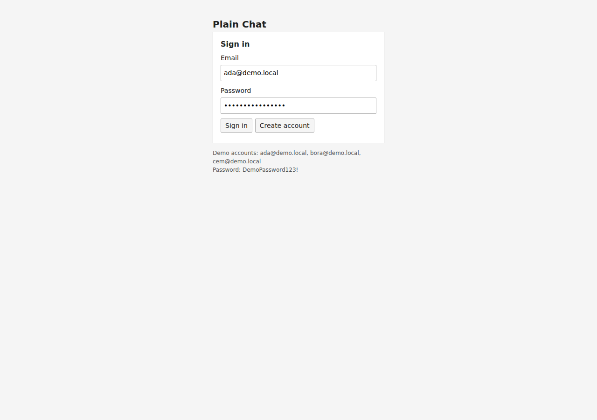
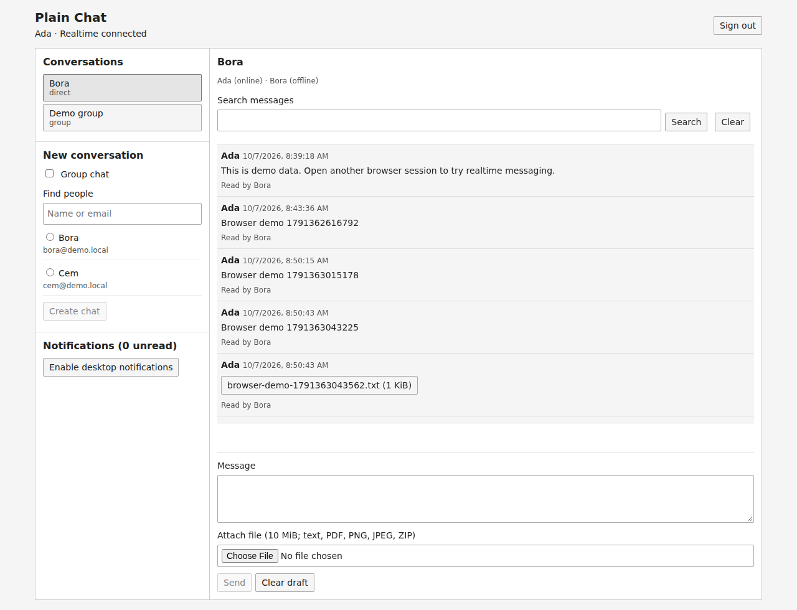
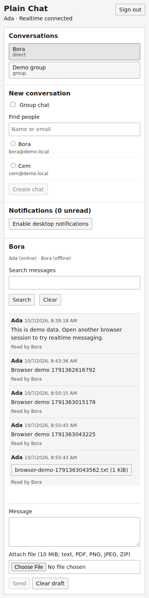

# Plain Chat — Gerçek zamanlı sohbet MVP'si

## Türkçe

Sade ve işlevsel bir sohbet uygulaması: Next.js/React arayüzü, ayrı Node.js/Express API'si, Socket.IO, Redis, PostgreSQL/Prisma ve S3/R2 uyumlu dosya depolama. Tasarım düz panellerden ve formlardan oluşur; gradyan, pazarlama ekranı ve animasyon yoktur. Bu depo yalnızca demo verileri ve açıkça örnek olan yerel kimlik bilgileri içerir. Gerçek sırları depoya eklemeyin.

### Ekran görüntüleri







### Özellikler

- Bire bir ve sabit üyeli grup sohbetleri; kullanıcı araması ve yeni sohbet oluşturma.
- Kalıcı mesajlar; HTTP ve Socket.IO üzerinden aynı gönderim servisi; eşzamanlı tekrarları engelleyen `clientId`.
- Çoklu tarayıcı/cihaz için çevrimiçi/çevrimdışı durum, yazıyor göstergesi ve monoton okundu işaretleri.
- Özel depolama, dosya doğrulama ve kısa ömürlü indirme bağlantıları; mesaj başına en fazla 5 dosya.
- Kalıcı uygulama içi bildirimler ve kullanıcı izniyle, sayfa arka plandayken masaüstü bildirimleri.
- Sohbet içi mesaj araması; mesajlarda ve bildirimlerde imleç tabanlı sayfalama.
- Kayıt, giriş, çıkış, çerez oturumları, üyelik denetimi, Redis hız sınırları ve sağlık uçları.
- Birim testleri, gerçek altyapı entegrasyon testleri ve iki tarayıcılı Playwright testi.

### Yerel kurulum

Node.js 24 LTS, npm ve Docker Compose v2 gerekir. API ve web varsayılan olarak 4000 ve 3000 portlarını kullanır. PostgreSQL 5434, Redis 6380 ve yerel S3 9000 portlarına yalnızca localhost üzerinden açılır.

```bash
cp .env.example .env
npm ci
docker compose up -d postgres redis storage
npm run db:generate
npm run db:migrate
npm run db:seed
npm run dev
```

`http://localhost:3000` adresini açın. Demo hesapları: `ada@demo.local`, `bora@demo.local`, `cem@demo.local`; tümünün parolası `DemoPassword123!`. İki farklı kullanıcıyla denemek için ayrı tarayıcı profilleri veya gizli pencere kullanın. Seed tekrar çalıştırılabilir; mevcut kullanıcıları ve mesajları değiştirmez. Dosya kovasını da oluşturur. `.env` Git tarafından yok sayılır.

Üretim derlemesini yerelde denemek için `npm run build`, ardından ayrı terminallerde `npm run start:api` ve `npm run start:web` çalıştırın. Web derleme sırasında `NEXT_PUBLIC_API_URL` değerini içine alır; bu değer tarayıcının erişebildiği API adresi olmalıdır.

### Docker

```bash
cp .env.example .env
docker compose up -d --build
docker compose ps
docker compose logs api web
```

Compose PostgreSQL, Redis ve yerel S3 emülatörü LocalStack'i başlatır; tek seferlik `migrate` ve `seed` servislerinden sonra API ve web servislerini açar. Sağlık kontrolleri bağımlılık sırasını belirler. `migrate` ve `seed` servislerinin 0 koduyla çıkması normaldir. API/web konteynerleri root olmayan `node` kullanıcısıyla çalışır. Docker'da Node 24 kullanılır. Demo Compose ayarları üretim ortamı değildir.

```bash
docker compose stop
docker compose down
# Yalnızca demo verilerini tamamen silmek istiyorsanız:
docker compose down -v
```

PostgreSQL ve Redis named volume kullanır. LocalStack Community S3 verilerinin yeniden başlatma sonrası korunacağı varsayılmaz; gerekiyorsa `docker compose run --rm seed` ile kovayı yeniden oluşturun. Silinen nesnelere ait eski dosya kayıtları indirme hatası verebilir. Kalıcı dosyalar için gerçek S3/R2 kullanın.

### Mimari ve veri akışı

```text
Tarayıcı / Next.js (3000)
   ├─ HTTP + HttpOnly çerez ──> Express API (4000)
   └─ WebSocket + aynı çerez ─> Socket.IO
                                   ├─ Prisma ─> PostgreSQL
                                   ├─ Redis: hız sınırı, varlık TTL, Pub/Sub adapter
                                   └─ S3/R2: nesne yükleme, imzalı indirme
```

`src/server/app.ts` HTTP uçlarını, `chat.ts` yetkilendirme ve işlemleri, `realtime.ts` socket olaylarını, `auth.ts` oturumları yönetir. `src/app` sade arayüzdür. `prisma/schema.prisma` veri modelini, `prisma/migrations` sürümlü SQL'i içerir. Tek npm projesi, ayrı API ve web süreçleri kullanılır.

Bir gönderim işleminde mesaj, dosya bağlama, sohbet güncellemesi ve alıcı bildirimleri tek PostgreSQL transaction'ında yazılır. `(senderId, clientId)` benzersizdir. Aynı UUID ve aynı içerikle tekrar gönderim kayıtlı mesajı döndürür; farklı içerik `409 IDEMPOTENCY_CONFLICT` üretir. Tekrar denemelerde aynı `clientId` kullanın. Arayüz zaman aşımında bunu korur ve tekrar deneme düğmesi gösterir. Tarayıcı yenilenirse bellek içindeki bekleyen gönderim kaybolur.

Mesaj sırası PostgreSQL `BigInt seq` ile belirlenir; JSON'da ondalık string olarak iletilir. `id` imleci aynı sohbete ait olmalıdır; sorgu daha küçük `seq` değerlerini getirir. Bildirimler `(createdAt, id)` ile sıralanır. Okundu işareti `lastReadSeq` yalnızca ilerler. Arama sonuçları otomatik okundu sayılmaz; görünür sohbetin en yeni yüklenen mesajı okundu olarak işaretlenir.

Redis socket adapter çoklu API süreçlerine yayın yapar. Yalnızca WebSocket taşıması kullanılır; long polling yoktur. Her bağlantı için Redis sorted set'e 45 saniyelik varlık kaydı yazılır ve 15 saniyede bir yenilenir. Bir bağlantı kapanınca diğerleri korunur. Çöken süreçlerin kayıtları süresi dolunca temizlenir. Arayüz 15 saniyelik HTTP uzlaştırmasıyla kaçan olayları ve eski varlık durumunu onarır; yeniden bağlanmada son mesajları getirir.

### HTTP API

Yanıtlar JSON'dur; yükleme `multipart/form-data` kullanır. Sağlık, kayıt ve giriş dışında oturum gerekir. POST isteklerinde `Origin` tam olarak `WEB_ORIGIN` olmalıdır; CLI istemcileri de bu başlığı göndermelidir. Hatalar `{ "error": "CODE" }` biçimindedir. Kimlikler UUID'dir.

| Yöntem ve yol | Gövde / sorgu / davranış |
|---|---|
| `POST /api/auth/register` | `{name,email,password}`; parola 10–128 karakter; oturum çerezi |
| `POST /api/auth/login` | `{email,password}`; oturum çerezi |
| `GET /api/auth/me` | `{id,name,email}` |
| `POST /api/auth/logout` | Geçerli oturumu siler ve o oturumun socket'lerini kapatır |
| `GET /api/users?q=...` | Ad/e-posta araması; en fazla 30 kullanıcı |
| `GET /api/conversations` | Üyesi olunan en fazla 100 sohbet; üyeler ve son mesaj |
| `POST /api/conversations` | `{kind:"direct",userIds:[peerId]}` veya `{kind:"group",name,userIds:[...]}`; oluşturucu dahil en fazla 20 kişi |
| `GET /api/conversations/:id/messages` | `?limit=30&cursor=UUID&q=metin`; `{items,nextCursor}`; en yeniden en eskiye |
| `POST /api/messages` | `{conversationId,clientId,body,attachmentIds:[]}`; yeni mesaj 201, tekrar 200; en fazla 4000 karakter |
| `POST /api/read` | `{conversationId,messageId}`; `{conversationId,userId,lastReadSeq}` |
| `GET /api/presence` | Ortak sohbet üyelerinin `{userId,online}` listesi |
| `POST /api/conversations/:id/files` | Tek `file` alanı, en fazla 10 MiB; `{id,name,mime,size}` |
| `GET /api/files/:id/download` | Üyelik denetimi sonrası `{url,expiresIn:60}` |
| `GET /api/notifications` | `?limit=30&cursor=UUID`; `{items,nextCursor,unread}` |
| `POST /api/notifications/:id/read` | Yalnızca kendi bildirimi; 204 |
| `GET /health/live` | Süreç ayakta: 200 |
| `GET /health/ready` | PostgreSQL, Redis yazma işlemi ve S3 kovası hazır: 200; aksi halde 503 |

Sayfa boyutu 1–100 aralığındadır. Sohbet üyeliği olmayan kullanıcı mesajları arayamaz, gönderemez, okuyamaz veya dosyalara erişemez. Gönderilmemiş dosyayı yalnızca yükleyen indirebilir. Dosya bir mesaja yalnızca bir kez bağlanabilir. Bildirim listeleme ve güncelleme kullanıcıya özeldir.

### Socket.IO sözleşmesi

API adresine `transports: ["websocket"]` ve `withCredentials: true` ile bağlanın. Handshake `Origin` ve geçerli oturum çerezi gerektirir. Oda katılımı sunucu tarafından kullanıcıya özel odalarla yönetilir; istemci keyfi oda seçemez. Her istemci olayında oturum, hız sınırı ve sohbet üyeliği yeniden denetlenir. Oturum süresi dolduğunda bağlantı kapatılır.

| İstemci → sunucu | Veri |
|---|---|
| `message:send` | HTTP gönderim gövdesiyle aynı |
| `typing:set` | `{conversationId,typing:boolean}` |
| `message:read` | `{conversationId,messageId}` |

Ack: `{ok:true,data:...}` veya `{ok:false,error:"CODE"}`. `message:send` mesajı, `message:read` okundu işaretini, `typing:set` null döndürür. `clientId` HTTP ve socket yollarında aynı anlamı taşır.

| Sunucu → istemci | Veri |
|---|---|
| `message:new` | Kaydedilmiş mesaj, güvenli gönderen alanları ve dosya metaverileri |
| `notification:new` | `{id,userId,messageId,createdAt,readAt}` |
| `typing:update` | `{conversationId,userId,typing}`; arayüzde 4 saniyede söner |
| `receipt:update` | `{conversationId,userId,lastReadSeq}` |
| `presence:update` | `{userId,online}`; yalnızca ortak sohbet üyelerine |
| `conversation:update` | `{conversationId}`; sohbet listesini yeniden getirin |

Pub/Sub kalıcı olay kuyruğu değildir. Bağlantı kaçırıldığında HTTP geçmişini ve bildirimleri getirin. Mesajın veritabanına yazılması ile yayın arasında süreç çökerse mesaj yine kalıcıdır; yayın garantili değildir.

### Güvenlik ve yapılandırma

- Parolalar rastgele salt ile Node `scrypt` kullanılarak hash'lenir. 32 bayt rastgele oturum token'ının yalnızca SHA-256 özeti veritabanında saklanır.
- Çerez `HttpOnly`, `SameSite=Lax`, süreli ve yapılandırmaya göre `Secure` olur. `SESSION_DAYS` 1–30, varsayılan 7'dir. Yerel HTTP örneği `COOKIE_SECURE=false` kullanır; TLS dağıtımında true kullanın.
- CORS tek `WEB_ORIGIN` kabul eder; POST ve socket handshake aynı origin'i zorunlu kılar. Üretimde web ve API'yi aynı site altında, TLS ve güvenilir reverse proxy ile sunun. Proxy güveni otomatik açılmaz; yanlış yapılandırma IP hız sınırlarını tüm kullanıcılara uygulayabilir.
- Prisma parametreli sorgular, Zod doğrulama, Helmet, sınırlı JSON gövdesi, güvenli hata yanıtları ve Next.js güvenlik başlıkları kullanılır. Kullanıcı içeriği React tarafından metin olarak render edilir.
- Atomik Redis sınırları: HTTP IP başına 300/dakika ve kullanıcı başına 240/dakika; giriş/kayıt toplam IP başına 10/dakika; gönderim kullanıcı başına 60/dakika (HTTP/socket ortak); sohbet oluşturma 20/dakika; yükleme 10/dakika; socket bağlantısı IP başına 60/dakika; socket yazıyor ve okundu olaylarının her biri kullanıcı başına 120/dakika. Redis erişilemezse işlem kabul edilmez. HTTP 429 yanıtı `Retry-After: 60` içerir.
- Dosyalar bellekte en fazla 10 MiB tutulur. Yalnızca UTF-8 düz metin, PDF, PNG, JPEG ve ZIP kabul edilir; MIME ile dosya imzası/UTF-8 tutarlılığı denetlenir. Bu kontrol antivirüs değildir. HTML/SVG kabul edilmez. İndirme `attachment` ve `application/octet-stream` olarak imzalanır.
- Gerçek S3/R2 kovası özel olmalı ve genel erişim engellenmelidir. Uygulama nesne put/get/delete ve readiness için head-bucket yetkisi ister; seed ek olarak create-bucket isteyebilir. Önceden oluşturulmuş kovayla seed create-bucket gerektirmez. LocalStack güvenlik sınırı veya gerçek kimlik denetimi değildir; sadece yerel emülatördür.
- `S3_ENDPOINT` sunucu içi, opsiyonel `S3_PUBLIC_ENDPOINT` tarayıcıya açık imzalama adresidir. Compose bunu localhost:9000 olarak ayarlar. R2 için hesap endpoint'i, region `auto`, uygun kova ve ortamdan verilen kimlik bilgilerini kullanın; `S3_FORCE_PATH_STYLE` sağlayıcıya göre ayarlanır. Sırlar `NEXT_PUBLIC_*` alanlarına yazılmamalıdır.
- `.env.example` ve Compose kimlik bilgileri yalnızca demo değerleridir. Gerçek dağıtımda secret manager/ortam değişkeni kullanın. `package-lock.json` kilitlidir; Prisma yapılandırmasının transitif `deepmerge-ts` bağımlılığı güvenlik düzeltmesi içeren 8.0.2'ye override edilmiştir ve generate/migrate akışı test edilir.

### Testler ve doğrulama

```bash
npm run lint
npm run typecheck
npm test
npm run build
npm audit
```

Gerçek entegrasyon testleri ayrı `_test` isimli PostgreSQL veritabanı, sıfır olmayan Redis logical DB ve `-test` eki olan S3 kovası kullanır. Test runner aynı uygulama/test bağlantısını reddeder. Testler bu test veritabanının tablolarını ve test Redis DB'sini temizler; demo veritabanına uygulanmamalıdır.

```bash
docker compose up -d postgres redis storage
# İlk çalıştırmada bir kez; zaten varsa bu komut hata verebilir:
docker compose exec -T postgres createdb -U chat_demo chat_test
npm run test:integration
```

`.env.example` içindeki `TEST_DATABASE_URL` ve `TEST_REDIS_URL` test runner tarafından yüklenir. Migration otomatik uygulanır; test kovası oluşturulur ve test sonrasında silinir. Entegrasyon paketi gerçek HTTP ve socket bağlantılarıyla yetkisiz erişimi, eşzamanlı tekrarları, transaction bildirimlerini, arama/sayfalamayı, monoton okundu durumunu, dosya indirmeyi, hız sınırlarını ve çoklu bağlantı/çıkış davranışını ve Redis üzerinden iki API süreci arasındaki yayını sınar.

```bash
npm run db:seed
npm run build
npx playwright install --with-deps chromium
npm run test:e2e
```

Playwright derlenmiş API ve web süreçlerini başlatır veya mevcut localhost süreçlerini kullanır. Demo hesaplarına giriş yapar; iki tarayıcı arasında yazıyor durumu, mesaj, okundu, dosya yükleme/indirme, tekrarlanan arama ve çıkış akışlarını dener. Demo veritabanına açıkça demo mesajlar/dosyalar ekler. Ekran görüntüsü `test-results/plain-chat.png` içine kaydedilir; başarısızlık trace'leri ve çıktılar Git'e eklenmez. Uçtan uca test varsayılan 3000/4000 portlarını bekler.

### Bilinen sınırlamalar

- Grup üyeleri oluşturma sırasında sabittir; üye yönetimi, grup silme, mesaj düzenleme/silme ve moderasyon yoktur. Kullanıcı rehberi giriş yapanlara ad/e-posta gösterir.
- E-posta doğrulaması, parola sıfırlama, MFA ve tüm cihazlardan çıkış yoktur. Süresi dolmuş oturumlar ve gönderilmemiş dosyalar için periyodik temizlik işi yoktur.
- E2E şifreleme, antivirüs, Web Push/mobil push, kapalı tarayıcı bildirimleri ve çevrimdışı gönderim kuyruğu yoktur. Masaüstü bildirim tercihi yalnızca mevcut sayfa oturumunda tutulur.
- Arama sohbete özel, büyük/küçük harf duyarsız substring aramasıdır; tam metin indeksleme yoktur. Kullanıcı listesi 30, sohbet listesi 100 ile sınırlıdır; bu listelerde sayfalama yoktur. Mesajlar ve bildirimler imleçle sayfalanır.
- Redis yayınları kaçabilir; HTTP uzlaştırması en yeni 30 mesajı getirir, daha eski mesajlar yükleme düğmesiyle alınır. Varlık durumu süreç çöküşünden sonra TTL ve polling nedeniyle gecikmeli güncellenebilir.
- Dağıtık transaction outbox, garantili olay teslimi ve uzun süreli bağlantı kurtarma yoktur. İdempotency kalıcı kayıt bazındadır; transport teslim garantisi değildir.
- Yerel LocalStack'in nesne kalıcılığı ve IAM/imza denetimi üretim S3'ünün yerine geçmez. Demo Docker portları yalnızca localhost'a bağlıdır. Üretim için TLS, özel kova, gerçek sırlar, yedekleme, izleme ve ölçek/kapasite planı gerekir.

### Kaynaklar

WebSocket/çoklu süreç davranışı [Socket.IO Redis adapter belgelerine](https://socket.io/docs/v4/redis-adapter) dayanır. Kurulum ve derleme için [Next.js belgeleri](https://nextjs.org/docs/app/getting-started/installation), migration akışı için [Prisma v6 belgeleri](https://www.prisma.io/docs/orm/v6/prisma-client/deployment/deploy-migrations-from-a-local-environment) kullanılmıştır.

---

## English

A plain, functional chat application: a Next.js/React frontend, separate Node.js/Express API, Socket.IO, Redis, PostgreSQL/Prisma, and S3/R2-compatible file storage. The UI uses flat panels and forms, with no gradients, marketing screens, or animations. This repository contains only demo data and explicitly local example credentials. Never commit real secrets.

### Screenshots


### Features

- One-to-one and fixed-membership group chats; user search and conversation creation.
- Durable messages; the same send service over HTTP and Socket.IO; `clientId` prevents concurrent duplicates.
- Online/offline presence across browsers/devices, typing indicators, and monotonic read receipts.
- Private storage, file validation, and short-lived download links; up to 5 files per message.
- Durable in-app notifications and opt-in desktop notifications when the page is in the background.
- Conversation-scoped message search; cursor pagination for messages and notifications.
- Registration, login, logout, cookie sessions, membership authorization, Redis rate limits, and health endpoints.
- Unit tests, real infrastructure integration tests, and a two-browser Playwright test.

### Local setup

Requires Node.js 24 LTS, npm, and Docker Compose v2. API and web default to ports 4000 and 3000. PostgreSQL 5434, Redis 6380, and local S3 9000 are exposed only on localhost.

```bash
cp .env.example .env
npm ci
docker compose up -d postgres redis storage
npm run db:generate
npm run db:migrate
npm run db:seed
npm run dev
```

Open `http://localhost:3000`. Demo accounts: `ada@demo.local`, `bora@demo.local`, `cem@demo.local`; all passwords are `DemoPassword123!`. Use separate browser profiles or a private window to try two users. Seeding is repeatable and does not change existing users or messages. It also creates the file bucket. Git ignores `.env`.

To try the production build locally, run `npm run build`, then `npm run start:api` and `npm run start:web` in separate terminals. The web build embeds `NEXT_PUBLIC_API_URL`; this must be an API address reachable by the browser.

### Docker

```bash
cp .env.example .env
docker compose up -d --build
docker compose ps
docker compose logs api web
```

Compose starts PostgreSQL, Redis, and the LocalStack local S3 emulator, then one-shot `migrate` and `seed` services before API and web. Health checks determine dependency order. Exit code 0 for `migrate` and `seed` is normal. API/web containers run as the non-root `node` user. Docker uses Node 24. Demo Compose settings are not a production deployment.

```bash
docker compose stop
docker compose down
# Only if you want to delete all demo data:
docker compose down -v
```

PostgreSQL and Redis use named volumes. Do not assume LocalStack Community S3 data survives a restart; recreate the bucket with `docker compose run --rm seed` if needed. Old file records for deleted objects may fail to download. Use real S3/R2 for durable files.

### Architecture and data flow

```text
Browser / Next.js (3000)
   ├─ HTTP + HttpOnly cookie ──> Express API (4000)
   └─ WebSocket + same cookie ─> Socket.IO
                                    ├─ Prisma ─> PostgreSQL
                                    ├─ Redis: rate limits, presence TTL, Pub/Sub adapter
                                    └─ S3/R2: object uploads, signed downloads
```

`src/server/app.ts` owns HTTP endpoints, `chat.ts` authorization and transactions, `realtime.ts` socket events, and `auth.ts` sessions. `src/app` is the plain UI. `prisma/schema.prisma` defines the data model and `prisma/migrations` contains versioned SQL. A single npm project runs separate API and web processes.

A send writes the message, attachment claims, conversation update, and recipient notifications in one PostgreSQL transaction. `(senderId, clientId)` is unique. Retrying the same UUID with the same content returns the saved message; different content produces `409 IDEMPOTENCY_CONFLICT`. Keep the same `clientId` when retrying. The UI preserves it after a timeout and shows a retry button. Refreshing the browser loses the in-memory pending send.

Messages are ordered by PostgreSQL `BigInt seq`, transmitted as a decimal string in JSON. The `id` cursor must belong to the same conversation; queries return smaller `seq` values. Notifications use `(createdAt, id)` order. Read watermark `lastReadSeq` only advances. Search results are not automatically marked read; the latest loaded message in a visible chat is marked read.

The Redis socket adapter broadcasts across API processes. Only WebSocket transport is used; there is no long polling. Each connection gets a 45-second presence entry in a Redis sorted set, renewed every 15 seconds. Closing one connection preserves the others. Crashed-process entries are removed after expiry. The UI reconciles via HTTP every 15 seconds to repair missed events and stale presence, and fetches recent messages on reconnect.

### HTTP API

Responses are JSON; uploads use `multipart/form-data`. Sessions are required except for health, registration, and login. POST requests must send an `Origin` exactly matching `WEB_ORIGIN`; CLI clients must also send it. Errors use `{ "error": "CODE" }`. Identifiers are UUIDs.

| Method and path | Body / query / behavior |
|---|---|
| `POST /api/auth/register` | `{name,email,password}`; password 10–128 characters; session cookie |
| `POST /api/auth/login` | `{email,password}`; session cookie |
| `GET /api/auth/me` | `{id,name,email}` |
| `POST /api/auth/logout` | Deletes the current session and disconnects its sockets |
| `GET /api/users?q=...` | Name/email search; at most 30 users |
| `GET /api/conversations` | At most 100 joined conversations; members and latest message |
| `POST /api/conversations` | `{kind:"direct",userIds:[peerId]}` or `{kind:"group",name,userIds:[...]}`; up to 20 people including creator |
| `GET /api/conversations/:id/messages` | `?limit=30&cursor=UUID&q=text`; `{items,nextCursor}`; newest first |
| `POST /api/messages` | `{conversationId,clientId,body,attachmentIds:[]}`; new message 201, retry 200; up to 4000 characters |
| `POST /api/read` | `{conversationId,messageId}`; `{conversationId,userId,lastReadSeq}` |
| `GET /api/presence` | `{userId,online}` list for shared conversation members |
| `POST /api/conversations/:id/files` | One `file` field, at most 10 MiB; `{id,name,mime,size}` |
| `GET /api/files/:id/download` | `{url,expiresIn:60}` after membership authorization |
| `GET /api/notifications` | `?limit=30&cursor=UUID`; `{items,nextCursor,unread}` |
| `POST /api/notifications/:id/read` | Own notification only; 204 |
| `GET /health/live` | Process is up: 200 |
| `GET /health/ready` | PostgreSQL, Redis writes, and S3 bucket ready: 200; otherwise 503 |

Page size is 1–100. Nonmembers cannot search, send, or read messages, or access files. Only the uploader can download an unsent file. A file can be attached to a message only once. Notification listing and updates are scoped to the current user.

### Socket.IO contract

Connect to the API with `transports: ["websocket"]` and `withCredentials: true`. The handshake requires `Origin` and a valid session cookie. The server manages user-specific rooms; clients cannot select arbitrary rooms. Every client event rechecks session, rate limit, and conversation membership. Connections close when sessions expire.

| Client → server | Data |
|---|---|
| `message:send` | Same as the HTTP send body |
| `typing:set` | `{conversationId,typing:boolean}` |
| `message:read` | `{conversationId,messageId}` |

Ack: `{ok:true,data:...}` or `{ok:false,error:"CODE"}`. `message:send` returns the message, `message:read` the read watermark, and `typing:set` null. `clientId` has identical semantics across HTTP and sockets.

| Server → client | Data |
|---|---|
| `message:new` | Saved message, safe sender fields, and file metadata |
| `notification:new` | `{id,userId,messageId,createdAt,readAt}` |
| `typing:update` | `{conversationId,userId,typing}`; expires in the UI after 4 seconds |
| `receipt:update` | `{conversationId,userId,lastReadSeq}` |
| `presence:update` | `{userId,online}`; shared conversation members only |
| `conversation:update` | `{conversationId}`; refetch the conversation list |

Pub/Sub is not a durable event queue. Fetch HTTP history and notifications after missed connections. If a process crashes between database commit and publication, the message remains durable but broadcast is not guaranteed.

### Security and configuration

- Passwords use Node `scrypt` with a random salt. Only the SHA-256 hash of the random 32-byte session token is stored in the database.
- Cookies are `HttpOnly`, `SameSite=Lax`, expiring, and optionally `Secure`. `SESSION_DAYS` is 1–30, default 7. The local HTTP example uses `COOKIE_SECURE=false`; use true with TLS.
- CORS accepts one `WEB_ORIGIN`; POST and socket handshakes require the same origin. Deploy web and API on the same site with TLS and a trusted reverse proxy. Proxy trust is not automatically enabled; incorrect configuration can apply IP limits to all users together.
- Prisma parameterized queries, Zod validation, Helmet, bounded JSON bodies, safe error responses, and Next.js security headers are used. React renders user content as text.
- Atomic Redis limits: HTTP 300/minute per IP and 240/minute per user; combined login/register 10/minute per IP; sends 60/minute per user shared across HTTP/sockets; conversation creation 20/minute; uploads 10/minute; socket connects 60/minute per IP; socket typing and read events each 120/minute per user. Requests fail closed when Redis is unavailable. HTTP 429 includes `Retry-After: 60`.
- Files are buffered in memory up to 10 MiB. Only UTF-8 plain text, PDF, PNG, JPEG, and ZIP are accepted; MIME and signatures/UTF-8 consistency are checked. This is not antivirus scanning. HTML/SVG are rejected. Downloads are signed as `attachment` and `application/octet-stream`.
- Real S3/R2 buckets must be private with public access blocked. The app needs object put/get/delete and head-bucket permission for readiness; seed may additionally require create-bucket. With a precreated bucket, seed does not require create-bucket. LocalStack is not a security boundary or real identity enforcement, only a local emulator.
- `S3_ENDPOINT` is the server-side endpoint; optional `S3_PUBLIC_ENDPOINT` is the browser-reachable signing endpoint. Compose sets this to localhost:9000. For R2, use the account endpoint, region `auto`, appropriate bucket, and environment-provided credentials; set `S3_FORCE_PATH_STYLE` for the provider. Never put secrets in `NEXT_PUBLIC_*` fields.
- `.env.example` and Compose credentials are demo values only. Use a secret manager/environment variables for real deployments. `package-lock.json` is committed; Prisma config's transitive `deepmerge-ts` dependency is overridden to security-fixed 8.0.2, and the generate/migrate workflow is tested.

### Tests and validation

```bash
npm run lint
npm run typecheck
npm test
npm run build
npm audit
```

Real integration tests use a separate PostgreSQL database ending in `_test`, a nonzero Redis logical database, and an S3 bucket ending in `-test`. The runner rejects identical application/test connections. Tests clear tables in this test database and the test Redis DB; never run them against the demo database.

```bash
docker compose up -d postgres redis storage
# Once before the first run; this may fail if it already exists:
docker compose exec -T postgres createdb -U chat_demo chat_test
npm run test:integration
```

The runner loads `TEST_DATABASE_URL` and `TEST_REDIS_URL` from `.env.example` values copied to `.env`. Migrations are applied automatically; the test bucket is created and deleted afterward. The integration suite uses real HTTP/socket connections to check unauthorized access, concurrent retries, transactional notifications, search/pagination, monotonic receipts, file downloads, rate limits, multi-connection/logout behavior, and broadcasts between two API processes through Redis.

```bash
npm run db:seed
npm run build
npx playwright install --with-deps chromium
npm run test:e2e
```

Playwright starts the compiled API and web processes or uses existing localhost processes. It logs into demo accounts and checks typing, messages, receipts, file upload/download, repeated search, and logout across two browsers. It adds explicitly demo messages/files to the demo database. The screenshot is saved to `test-results/plain-chat.png`; failure traces and outputs are not committed. E2E expects the default 3000/4000 ports.

### Known limitations

- Group membership is fixed at creation; no membership management, group deletion, message editing/deletion, or moderation. The user directory exposes names/emails to signed-in users.
- No email verification, password reset, MFA, or logout from all devices. No periodic cleanup job for expired sessions or unsent files.
- No end-to-end encryption, antivirus, Web Push/mobile push, notifications with the browser closed, or offline send queue. Desktop notification preference lasts only for the current page session.
- Search is conversation-scoped, case-insensitive substring search without full-text indexing. The user list is capped at 30 and conversation list at 100, without pagination for those lists. Messages and notifications use cursor pagination.
- Redis broadcasts can be missed; HTTP reconciliation fetches the latest 30 messages, with older messages available through the load button. Presence after process crashes can lag due to TTL and polling.
- No transactional outbox, guaranteed event delivery, or long-term connection recovery. Idempotency applies to durable records, not transport delivery guarantees.
- LocalStack object persistence and IAM/signature validation do not replace production S3. Demo Docker ports bind only to localhost. Production requires TLS, private buckets, real secrets, backups, monitoring, and capacity planning.

### References

WebSocket/multi-process behavior follows the [Socket.IO Redis adapter documentation](https://socket.io/docs/v4/redis-adapter). Setup/build uses the [Next.js documentation](https://nextjs.org/docs/app/getting-started/installation), and migration flow follows the [Prisma v6 documentation](https://www.prisma.io/docs/orm/v6/prisma-client/deployment/deploy-migrations-from-a-local-environment).
